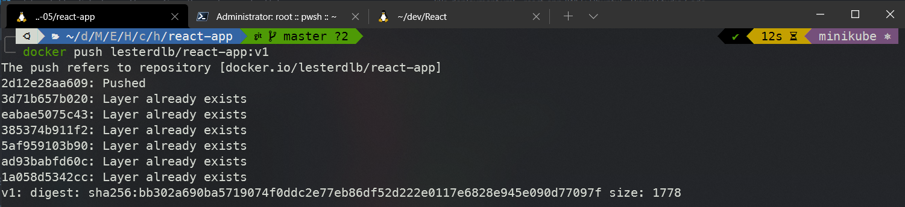
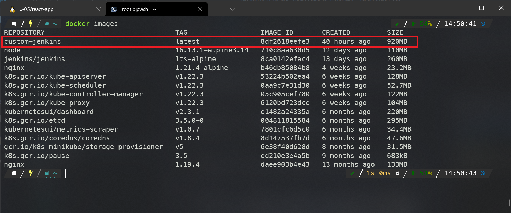
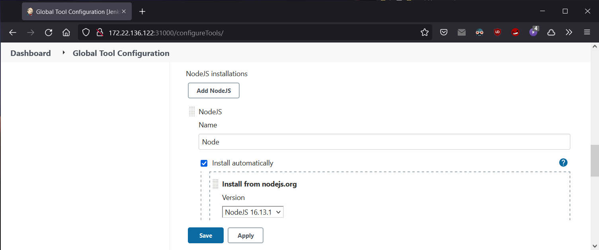

# CI-CD Exercise

He dividido el ejercicio en las siguientes partes:

1. Creación de la aplicación con su respectivo `Dockerfile` y `Deployment`
2. Configuración de `Jenkins` en `Minikube`
3. Implementación funcional del archivo `Jenkinsfile` en `Minikube`

- Repositorio con el código de la aplicación: https://github.com/lesterdlb/react-app
- Docker Hub: https://hub.docker.com/u/lesterdlb
- [Dockerfile](react-app/Dockerfile)
- [Manifiesto Kubernetes](react-app/k8s-deployment.yml)
- [Jenkinsfile](Jenkinsfile)

```console
├── img
├── Jenkins     # Configuración de Jenkins
├── react-app   # Código fuente
├── Jenkinsfile # Configuración de la Pipeline
└── README.MD
```

## 1. Creación de una aplicación simple en `React`

Aplicación de `React` creada utilizando `create-react-app`. Esta ya incluye un [test unitario](react-app/src/App.test.js) que simplemente verifica que un link ha sido renderizado por el `DOM` utilizando la librería `react-testing-library`

```
npx create-react-app react-app

npm test -- --watchAll=false

npm start
```


### **Creación de la imagen de `Docker`**

Para la imagen de `Docker` utilice un `Dockerfile` con dos etapas. En la primera utilizo una imagen de `node` basada en `alpine` para construir la aplicación, posteriormente utilizo una imagen de `nginx` también basada en `alpine` para reducir el tamaño de la aplicación a unos 20MB

```Docker
# Build
FROM node:16.13.1-alpine3.14 as build-stage

WORKDIR /app
COPY package*.json ./
RUN npm install
COPY . .

RUN npm run build

# Production
FROM nginx:1.21.4-alpine

COPY --from=build-stage /app/build /usr/share/nginx/html
EXPOSE 80

ENTRYPOINT [ "nginx","-g", "daemon off;" ]
```

Creación de la imagen:

```
docker build -t lesterdlb/react-app:v1 .
```


Docker Hub:

```
docker push lesterdlb/react-app:v1
```




### **Objeto `Deployment` con su respectivo servicio**

El archivo [k8s-deployment.yml](react-app/k8s-deployment.yml) crea el objeto `Deployment` con la imagen creada anteriormente y su respectivo `Service` que expone la aplicación en el puerto 30000.

```yml
apiVersion: v1
kind: Service
metadata:
  name: react-app-service
  labels:
    app: react-app
spec:
  type: NodePort
  selector:
    app: react-app
  ports:
    - port: 80
      targetPort: 80
      nodePort: 30000
---
apiVersion: apps/v1
kind: Deployment
metadata:
  name: react-app-deployment
  labels:
    app: react-app
spec:
  selector:
    matchLabels:
      app: react-app
  replicas: 1
  template:
    metadata:
      labels:
        app: react-app
    spec:
      containers:
        - name: react-app
          image: lesterdlb/react-app:v1
          ports:
            - containerPort: 80
          resources:
            limits:
              cpu: 500m
            requests:
              cpu: 200m
```

Aplicar el `Deployment` en `Minikube`:

```
k apply -f k8s-deployment.yml
```


### **Git**

Antes de configurar `Jenkins`, publique el código de la aplicación en el siguiente repositorio: https://github.com/lesterdlb/react-app

```
git add .dockerignore Dockerfile k8s-deployment.yml

git commit -m "Added docker and k8sdeployment"

git branch -M main

git push -u origin main

```


## 2. Configuración de `Jenkins` en `Minikube`

**Nota: He seguido como referencia este [articulo](https://medium.com/the-programmer/ci-cd-pipeline-with-jenkins-github-part-1-c057a31b5297) para configurar `Jenkins`**

El archivo [Jenkis/Dockerfile](Jenkins/Dockerfile) crea una imagen de `Jenkins` a partir del tag lts-alpine. En esta simplemente se instalan algunos plugins y las herramientas como `Docker` y `Kubectl`.

Utilizo el siguiente comando para poder conectarme desde `Windows` a motor de `Docker` que tiene `Minikube`:

```
minikube -p minikube docker-env --shell powershell | Invoke-Expression
```

Una vez hecha la referencia procedo a crear la imagen de `Docker` de `Jenkins` dentro de `Minikube`

```
docker image build -t custom-jenkins .
```



Para levantar `Jenkins` utilizo el archivo [Jenkis/jenkins-k8s.yaml](Jenkins/jenkins-k8s.yaml) que crea los siguientes objetos dentro del clúster de `Minikube`:

- ServiceAccount
- Role
- RoleBinding
- ClusterRoleBinding
- ClusterRole
- Deployment
- Service

```
kubectl apply -f jenkins.yaml
```


Básicamente crea un `Deployment` con varios permisos de acceso para que `Jenkins` pueda hacer uso de motor de `Docker` en `Minikube`.


Puedo acceder `Jenkins` con la IP de `Minkube` en el puerto 31000. En mi caso la IP es: 172.22.136.122


Para comprobar que `Jenkins` es funcional ejecuto la siguiente `Pipeline`:


También agrego la instalación de `Node` dentro de Manage Jenkins -> Global Tool Configuration -> Node



Y por último Manage Jenkins -> Manage Credentials -> Jenkins -> Global credentials (unrestricted) para crear las credenciales de Dockerhub y poder publicar la imagen a mi [repositorio](https://hub.docker.com/u/lesterdlb).

## 3. Implementación funcional del archivo Jenkinsfile en Minikube

La estructura para ejecutar el Pipeline está en el archivo [Jenkinsfile](Jenkinsfile).

He divido los pasos de la siguiente manera:

1. Continuous Integration (CI)
   - Cloning Git
   - Build App
   - Test App
2. Continuous Delivery (CD)
   - Building Image
   - Push Image
   - Remove Unused Dooker Image
3. Continuous Deployment (CD)
   - Deploy to Minikube

Creo un proyecto de tipo `Pipeline`:


Una vez completada la `Pipeline` obtengo el siguiente resultado:


**Nota: Cada vez que corro la `Pipeline`, creo una nueva imagen con el BUILD_NUMBER como TAG. En el archivo [k8s-deployment.yml](react-app/k8s-deployment.yml) he puesto la variable de entorno ${BUILD_NUMBER} para poder obtener la nueva imagen creada**

Ejecución de la `Pipeline` en tiempo real:


